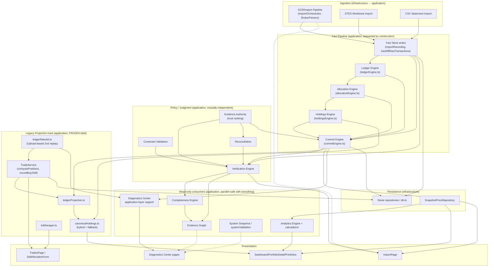

# Execution Graph

A task-planning map of this repository's subsystems, for deciding **what a change touches, what it
depends on, and what can safely proceed in parallel** — read this alongside `docs/ROADMAP.md` (the
backlog) and `docs/ARCHITECTURE.md` (the enforced layering) before starting multi-part work. This
document is a planning artifact for whoever (human or AI agent) works on this repo next; it does not
introduce any orchestration runtime into the app itself — nothing here changes how the product executes,
only how work on the product is scoped.

**This is a formalization, not a discovery of new structure.** Every edge below already exists as either
a TypeScript import, a Dexie table, or a rule in `.dependency-cruiser.cjs` / `src/architecture/regressionGuards.test.ts`.
Where this repo already has a deeper authority on a subsystem (`docs/PORTFOLIO_OS_V2_SPEC.md` Part 5's
Ownership Matrix, `docs/ARCHITECTURAL_DEBT.md`'s violation catalog), this document links to it rather than
re-deriving it — this file's job is the cross-subsystem *shape*, not the per-field detail.

A machine-readable companion, `docs/EXECUTION_GRAPH.json`, carries the same 32 nodes plus criticality,
required regression tests, files owned, and public interfaces per node — see "Impact map" below.

## How to use this

1. Find the node(s) your task touches in the table below.
2. Read every node upstream of it (its "Depends on" column, transitively) — those behaviors are
   assumed, not renegotiated, by your change.
3. Skim every node downstream of it ("Consumers") — those are what you might silently break.
4. Two nodes can be worked on **in parallel** (by two people, or two agents) only if neither is upstream
   of the other *and* their "Shared state" columns don't intersect. See "Parallel-work rules" below —
   this is stricter than "different files," because several nodes share Dexie tables or a canonical
   single-owner function without importing each other directly.
5. If your task would add a new writer to a table already listed as `FROZEN` in
   `docs/ARCHITECTURAL_DEBT.md`, or a new implementation of a function `regressionGuards.test.ts` asserts
   is singular — stop and treat it as a policy decision, not a routine change. The guard will fail CI
   either way; this graph exists so that's known before work starts, not after.

## Layering (recap — full detail in `docs/ARCHITECTURE.md`)

```
presentation  →  application  →  domain
infrastructure  →  domain
```

Machine-enforced by `.dependency-cruiser.cjs` (`npm run arch:check`). Every node below lives inside
exactly one of these four layers; the graph in this document is the **intra-layer and cross-layer
dependency structure inside that boundary**, one level more granular than the four-layer diagram.

## The graph



Solid arrows are hard data/type dependencies (an import or a direct call). Dotted arrows are "reads the
output of" without a compile-time dependency (e.g. a UI page reading a repository the engine also writes
through).

## Subsystem table

| Node | Responsibility | Inputs | Outputs | Depends on | Consumers | Shared state |
|---|---|---|---|---|---|---|
| **Fact Store writes** (`importRecording.ts`, `backfillRawTransactions.ts`, `rawTransactionFolds.ts`) | Append-only creation of `RawTransaction` facts from parsed evidence | `ParsedTradeCandidate`/`ParsedDividendCandidate`, existing facts (for identity dedup via `findLiveExecutionFact`) | New `RawTransaction` rows | `evidenceAuthority.ts` (authority rank on write) | Ledger Engine, Commit Engine, Verification Engine | `rawTransactions` table (append-only, structurally enforced — see `RawTransactionRepository`) |
| **Ledger Engine** (`ledgerEngine.ts`) | Pure replay: `RawTransaction[]` → `LedgerEvent[]` for one (portfolio, ticker) | Facts | `LedgerEvent[]` | `ledgerRebuild.ts` (canonicalization only) | Allocation Engine, Commit Engine, Holdings Engine, System Snapshot | None (pure function; `regressionGuards.test.ts` asserts this file is the only definer of `generateLedgerEvents`) |
| **Allocation Engine** (`allocationEngine.ts`) | Pure replay: `LedgerEvent[]` → `Allocation[]` | LedgerEvents | `Allocation[]` | Ledger Engine (types only) | Commit Engine, Holdings Engine, System Snapshot | None (pure; sole definer of `generateAllocations`) |
| **Holdings Engine** (`holdingsEngine.ts`) | Pure replay: Ledger + Allocations → current positions | LedgerEvents, Allocations | Position map | Ledger Engine, Allocation Engine (types only) | `canonicalHoldings.ts`, `systemValidation.ts`, System Snapshot | None (pure; one of 3 frozen position-computation functions) |
| **Commit Engine** (`commitEngine.ts`) | Orchestrates verify → replay → cache for one (portfolio, ticker); the only writer of `CommittedLedgerRepository` | Facts for the key | `ledgerCache`/`allocationsCache` rows | Verification Engine, `ledgerProjection.ts`, `ledgerRebuild.ts` (canonicalKey), `evidenceAuthority.ts`, `duplicateDetection.ts` | `PortfolioService`, `lotManager.ts`, `reconciliationSweep.ts`, `systemSnapshot.ts`, ImportPage | `ledgerCache`, `allocationsCache` (full delete-and-replace per key — **never** patched incrementally); serialized per `${portfolioId}|${ticker}` via `serialize.ts` |
| **Verification Engine** (`verificationEngine.ts`) | Judges each fact Verified/Rejected/Needs Review; computes per-ticker match status | Facts, positions | `TransactionVerification`, `TickerStatus` | `importVerification.ts`, `reconciliation.ts`, `mismatchResolver.ts`, `netShareTimeline.ts`, `constraintValidation.ts`, `rawTransactionFolds.ts` | Commit Engine, Completeness Engine, Evidence Graph, System Snapshot, ImportPage (legacy path, see debt 3.2) | None — pure, read-only; sole definer of `verifyAll`/`verifyAllDetailed`/`verifyTicker` |
| **Completeness Engine** (`completenessEngine.ts`) | Builds minimal-document recovery plans for gaps | Verification output, evidence coverage | `RecoveryPlan` | Verification Engine, `evidenceCoverage.ts` | Evidence Graph, ImportPage | None — pure |
| **Evidence Graph** (`evidenceGraph.ts`) | Read-only composed view: transactions/documents/ticker-position nodes + corroborate/contradict/missing edges | Verification + Completeness output | `{nodes, edges}` | Verification Engine, Completeness Engine, `evidenceCoverage.ts` | Diagnostics Center UI | None — deliberately unpersisted, rebuilt on every read |
| **Reconciliation** (`reconciliation.ts`, `reconciliationSweep.ts`, `mismatchResolver.ts`) | Compares ledger position to `PositionVerification` ground truth; ticker-wide sweep re-commit | Positions, verifications, facts | Mismatch flags, sweep results | `importVerification.ts`, `evidenceAuthority.ts`, `duplicateDetection.ts`, Commit Engine (sweep only) | Verification Engine, PortfolioDetailPage | `verifications` table (owned-mutable) |
| **Evidence Authority** (`evidenceAuthority.ts`) | Canonical trust/authority ranking (`authorityRank`, `higherAuthority`) | Document/source type | Rank | None | Fact Store writes, Commit Engine, Reconciliation, System Snapshot, `lotManager.ts` | None — the **only** file allowed to define an `AUTHORITY_RANK`-shaped table (CI-guarded) |
| **Constraint Validation** (`constraintValidation.ts`) | Inventory/completeness contradiction checks | Facts | `InventoryContradiction[]`, `TickerConstraintReport` | `importVerification.ts` (types) | Verification Engine, `ledgerRebuild.ts` | None — pure |
| **TradeService** (legacy projection) | Use-case layer for Buy/Sell/delete/move on `Trade`/`TradeAllocation`; `computePositions` | UI actions | `Trade`/`TradeAllocation` rows | `ledgerRebuild.ts` (canonicalKey), `ledgerProjection.ts` (resolveLotRef), `rawTransactionFolds.ts`, `duplicateDetection.ts` | `canonicalHoldings.ts`, TradesPage, SellAllocationForm, `ledgerRebuild.ts`, `systemValidation.ts` | `trades`, `tradeAllocations` (**dual-writer, FROZEN** — see `ARCHITECTURAL_DEBT.md` 1.1), `portfolios.cash` (**N writers, OPEN** — debt 1.2) |
| **ledgerProjection.ts** | Rewrites `trades`/`tradeAllocations` rows from replayed facts (the second, disclosed dual-writer) | Facts | `Trade`/`TradeAllocation` rows | `ledgerRebuild.ts`, `rawTransactionFolds.ts`, `duplicateDetection.ts`, Ledger/Allocation Engine types | `canonicalHoldings.ts`, Commit Engine, `lotManager.ts`, `reconciliationSweep.ts` | `trades`, `tradeAllocations` (same FROZEN pair as above) |
| **canonicalHoldings.ts** | Hybrid read: serves canonical (replay-derived) holdings when they agree with legacy, else falls back per-ticker with a disclosed reason | Both computations | Position map + fallback reasons | TradeService, Holdings Engine | Dashboard, PortfolioDetailPage, PortfoliosPage | None — read-only composition; one of 3 frozen position-computation functions |
| **ledgerRebuild.ts** | Alternate, Upload-based reconstruction with dry-run/apply split; the one deliberately-kept second replay pipeline | `Upload.candidates` | Diff vs. current ledger, auto-applicable metadata fixes | `reconciliation.ts`, `constraintValidation.ts`, `importVerification.ts`, TradeService | RebuildLedgerPanel (DataPage), Determinism E2E test | `trades`/`tradeAllocations` metadata-only writes (companyName/transactionNumber — never shares/allocations) |
| **lotManager.ts** | Ticker-scoped manual sell/allocation UI backend; the identity-collision fix's home | UI actions | Facts + replay for one ticker | `commitEngine.ts`, `ledgerEngine.ts`, `allocationEngine.ts`, `ledgerProjection.ts`, `evidenceAuthority.ts`, `serialize.ts` | TickerDetailPage's Lot Manager | `trades`/`tradeAllocations` (stale-allocation cleanup only, on retraction) |
| **PortfolioService.ts** | Deposits/withdrawals/cash adjustments/dividends/splits/rights-issues/archiving | UI actions | `Portfolio`, `TimelineEvent` rows | `commitEngine.ts` (appendAndMaybeCommit, retract) | PortfolioDetailPage, ImportPage (dividends), Dashboard | `portfolios`, `timelineEvents` (owned-mutable) |
| **pendingExecutions.ts** | Partial-fill executions awaiting invoice confirmation | OCR order evidence | `PendingExecution` rows | None (leaf) | ImportPage | `pendingExecutions` (owned-mutable, explicitly not a Fact) |
| **systemValidation.ts / systemSnapshot.ts** | Determinism/observability: cross-checks TradeService vs. Holdings Engine; exports a 7-category state hash | All engines | Validation report / hash | TradeService, Holdings Engine, Ledger/Allocation Engine, Verification Engine, Evidence Authority, Commit Engine | Determinism E2E test, `regressionGuards`-adjacent tooling | None — read-only |
| **Analytics Engine** (`AnalyticsEngine.ts` + `calculators/*.ts`) | Pure metrics: win rate, profit factor, exposure, health score, sector allocation, etc. | `{trades, allocations, timelineEvents, priceMap, cash}` | `AnalyticsResult` | None (each calculator is a standalone pure function; convergence point is `AnalyticsEngine.ts`'s registry) | AnalyticsPage, DashboardPage | None — pure, zero repository dependency |
| **Backup Service** (`BackupService.ts`) | Full-ledger export/import (JSON snapshot) | All 6 core tables | Snapshot file / full replace | None | DataPage | `portfolios`, `trades`, `tradeAllocations`, `timelineEvents`, `journalEntries`, `verifications` (full replace, bulk path — listed as a disclosed exception in the dual-writer guard) |
| **OCR/Import Pipeline** (`ImportOrchestrator.ts`, `parsers/*`, `imagePreprocess.ts`, `tesseractClient.ts`, `pdfText.ts`) | File → `ParsedTradeCandidate`/`ParsedDividendCandidate`/`ParsedOrderEvidence` | Screenshots, PDFs, CSVs | Parsed candidates | `BrokerParser` interface (each parser is independent — `ThndrParser.ts`, `CsvStatementParser.ts`) | ImportPage, Fact Store writes (via `importRecording.ts`) | None directly — writes go through Fact Store writes |
| **STES Workbook Import** (`StesWorkbookParser.ts`) | Frozen AI-exchange `.xlsx` contract → same candidate shapes | STES v1.1 workbook | Parsed candidates | None (routed by `ImportOrchestrator` before text extraction, not a `BrokerParser`) | Fact Store writes | None |
| **Thndr Orders Workbook** (`ThndrOrdersWorkbookParser.ts`) | Account-wide "Orders" export parsing | Workbook | Order evidence rows | None | Verification Engine (order-confirmation evidence) | None |
| **Dexie Persistence** (`db.ts`, `repositories/*.ts`, `purge.ts`) | Implements every domain repository port; the only code allowed to touch `db.ts` directly (dependency-cruiser-enforced) besides `purge.ts` | Domain entities | Persisted rows | Domain repository interfaces only | Every application-layer node (indirectly, via `AppRepositories`) | All 11 Dexie tables (see `regressionGuards.test.ts`'s categorized allowlist) |
| **SnapshotPriceRepository** (`market-data/`) | Reads `public/price-snapshot.json`/`price-history.json`; the only class allowed to read price data | Static JSON snapshot (produced out-of-band by `scripts/fetch-prices` + `update-prices.yml`) | Current price / history per ticker | None | Analytics Engine, Dashboard, PortfolioDetailPage, `PriceFreshness` component | None (read-only static asset) |
| **Diagnostics recorder** (`infrastructure/diagnostics/*`) | Observe-only instrumentation (session/write/read/decision/rule/perf events) | Instrumented call sites | `DiagnosticEvent`/`DiagnosticCase` rows | None | Diagnostics Center pages only | `diagnosticEvents`, `diagnosticCases` — **structurally forbidden** from ever calling a business write method (CI-guarded, zero-tolerance) |
| **Diagnostics Center application-layer support** (`application/services/diagnostics/canonicalGroupEvidence.ts`, `retentionPolicy.ts`) | Application-layer helpers the recorder itself doesn't cover: read-only canonical-group evidence lookups (`CanonicalGroupEvidencePanel`) and startup retention pruning (`pruneDiagnostics`, called once per boot only when Developer Mode is on) | Facts (canonicalGroupEvidence), diagnostic repositories (retentionPolicy) | Evidence lookup results; pruned diagnostic rows | Commit Engine (`resolveCurrentPortfolioId`), `ledgerRebuild.ts` (`canonicalKey`), `duplicateDetection.ts`, `rawTransactionFolds.ts` | Diagnostics Center pages | `diagnosticEvents`/`diagnosticCases` (retention pruning's only write — disposable diagnostic rows, never business data, per DIAGNOSTICS_CENTER_SPEC.md Part 5.4) |
| **ImportPage** (presentation) | Two-phase Extract/Distribute import UI | OCR pipeline output, `importSession.ts` (localStorage-backed pool) | Committed facts via TradeService/Commit Engine/PortfolioService | OCR Pipeline, TradeService, Commit Engine, Verification Engine, PortfolioService, `duplicateDetection.ts` | — | **Known drift**: re-derives some verification signals instead of calling `verifyAllDetailed` (`ARCHITECTURAL_DEBT.md` 3.2) — treat as its own node when touching verification-adjacent UI logic, don't assume it already matches the engine |
| **Dashboard / PortfolioDetail / Portfolios pages** | Read canonical hybrid holdings + analytics for display | `canonicalHoldings.ts`, Analytics Engine, prices | Rendered UI | canonicalHoldings, Analytics Engine, SnapshotPriceRepository | — | Read-only |
| **TradesPage / SellAllocationForm** | Entity-CRUD and lot-picking UI reading `Trade` directly | TradeService | Rendered UI, sell allocations | TradeService | — | Reads `trades`/`tradeAllocations` directly (documented exception to the "read via canonical hybrid" rule — entity-CRUD/lot-picking needs raw rows) |
| **Diagnostics Center pages** | Session Recorder / Writer & Reader Trace / Case Detection UI | Diagnostics recorder, Evidence Graph, System Snapshot | Rendered UI | Diagnostics recorder, Evidence Graph | — | Read-only; never reads a business repository for a business decision (Part 5.4) |

## Parallel-work rules

Derived directly from the table above — these are the concrete answer to "what can run in parallel":

1. **Independent `BrokerParser` implementations are always parallel-safe.** Each parser owns its own
   file and is discovered by `ImportOrchestrator`'s array; the only shared file is `ImportOrchestrator.ts`
   itself (adding the new instance to the array) and `trackedDateRange.ts` (shared date-range helper —
   extend, don't fork). Two people adding two different brokers only conflict on those two files' diff
   hunks, never on parser logic.
2. **Independent analytics calculators are always parallel-safe.** Same shape as above: one file each,
   one shared registration point (`AnalyticsEngine.ts`). Zero repository/state coupling between
   calculators (they're pure functions over the same input struct).
3. **The Fact Pipeline (Fact Store → Ledger → Allocation → Holdings → Commit) is sequential by
   construction for a *single* (portfolioId, ticker) — this is enforced at runtime by `serialize.ts`'s
   per-key queue, not just convention.** Two tasks touching *different* tickers, or different portfolios,
   are genuinely concurrent already (the app itself relies on this). Two tasks touching the *same*
   pipeline stage for the *same* ticker are never safe to parallelize — treat as one task.
4. **Read-only nodes (Analytics Engine, Evidence Graph, System Snapshot, Completeness Engine,
   Diagnostics Center) are parallel-safe against everything**, including each other and the Fact
   Pipeline, because none of them write. A task confined to one of these can proceed independently of
   almost anything else in flight.
5. **The Legacy Projection track (TradeService, `ledgerProjection.ts`, `canonicalHoldings.ts`,
   `ledgerRebuild.ts`, `lotManager.ts`) is the one cluster where "different files" does NOT imply
   "parallel-safe"** — they share two Dexie tables (`trades`, `tradeAllocations`) already flagged
   `FROZEN` (dual-writer) in `ARCHITECTURAL_DEBT.md`. Two simultaneous tasks that each add a write path
   here are the exact bug class that dashboard exists to catch; route both through `regressionGuards.test.ts`'s
   allowlist check before merging either, don't just run them in parallel and hope CI sorts it out.
6. **Policy/Judgment nodes (Verification Engine, Constraint Validation, Reconciliation, Evidence
   Authority) are mutually independent from each other** (no imports between Reconciliation and
   Constraint Validation, for example) but **all sit upstream of Verification Engine** — a task changing
   one of them requires re-verifying Verification Engine's output, not just its own unit tests.
7. **Presentation pages are parallel-safe with each other** unless two tasks touch the same page file or
   a shared component/lib module (`presentation/lib/*`, `presentation/components/*`). `ImportPage.tsx` is
   the one page with real internal complexity (two-phase session state, `mergeSuggestions`,
   `importSession.ts`) — treat any second concurrent task on it as sequential with the first, not
   parallel, even if they touch different UI sections.
8. **A task cannot be parallelized against `.dependency-cruiser.cjs` or `regressionGuards.test.ts`
   themselves** — every other node's "safe to parallelize" status above is *only* true because those two
   files exist and run in CI. They are the single validation point every parallel branch of work
   converges back through, matching the diagram's own "Cross-cutting enforcement" role rather than being
   a node with peers.

## No architectural blockers found

Per this task's own scope (formalize, don't change business logic): nothing in the current architecture
prevents reasoning about it as a dependency graph, or scoping future work against it. The layering rules
(`.dependency-cruiser.cjs`) and the frozen-count guards (`regressionGuards.test.ts`) already encode most
of the edges and shared-state boundaries in this document as machine-checked assertions — this document
adds the *shape* (which nodes exist, how they cluster, what's safe to run in parallel) on top of
constraints that were already real and already enforced. No code changed to produce it.

## Impact map (machine-readable)

`docs/EXECUTION_GRAPH.json` is the same 32 nodes as the table above, in a machine-readable form with six
fields the prose table doesn't carry: **criticality**, **required regression tests** (co-located unit
tests, cross-cutting/integration tests, and CI regression guards — all three extracted or verified
against real files, not asserted from memory), **files owned**, and **public interfaces** (every
top-level `export` in each owned file). Upstream/downstream edges reference other nodes by `id` (e.g.
`"upstreamDependencies": [{"id": "verification-engine"}]`) or, for a shared leaf helper that isn't its
own node (`duplicateDetection.ts`, `serialize.ts`, `netShareTimeline.ts`), `{"external": "<name>", "note": "..."}`.
Every application/infrastructure node also depends on `src/domain` for types/ports per the enforced
layering (`ARCHITECTURE.md`) — omitted from each node's edge list since it's universal and never a
parallel-work conflict (domain is read-only from every other layer's perspective).

**Criticality** is a 4-level scale, defined once in the JSON's own `criticalityLevels` object so the
label means the same thing everywhere it's used:

| Level | Meaning | Count |
|---|---|---|
| `critical` | Writes or directly derives primary financial state (shares, cost basis, cash) in the replay/write path. A defect is a silent, compounding money-correctness bug. | 11 |
| `high` | Gates, corrects, or orchestrates what reaches a `critical` node, or aggregates `critical` nodes into a load-bearing decision. | 9 |
| `medium` | Derived, read-only, or observability output. Visible and correctable at read time; never mutates stored state. | 6 |
| `low` | Isolated leaf ingestion (gated by a `critical`/`high` node downstream before it can affect stored state), or purely additive, no-op-by-default instrumentation. | 6 |

**Required regression tests** per node has three parts, all machine-verified against the repo at
generation time (not hand-curated): `coLocatedUnitTests` (the file's own `*.test.ts(x)` siblings),
`crossCuttingOrIntegrationTests` (other test files whose imports reference this node's files — e.g. the
determinism E2E test importing the Ledger/Allocation/Holdings Engines), and `ciRegressionGuards` (the
specific `regressionGuards.test.ts` assertions that would fail if this node grew a new writer/duplicate
implementation — authored from that file directly, since a guard's existence isn't discoverable by
grepping the node's own files). Run all three before merging a change to a `critical` or `high` node;
`medium`/`low` nodes are adequately covered by `coLocatedUnitTests` alone in the common case.

Summary (full detail — responsibility, files, exports, every test path — is in the JSON, not repeated here):

| Node (`id`) | Criticality | Upstream | Downstream | Co-located tests | CI regression guards |
|---|---|---|---|---|---|
| Allocation Engine (`allocation-engine`) | critical | 1 | 5 | 1 | 1 |
| Backup Service (`backup-service`) | critical | 0 | 0 | 1 | 1 |
| Commit Engine (`commit-engine`) | critical | 8 | 6 | 3 | 0 |
| Dexie Persistence (`dexie-persistence`) | critical | 0 | 1 | 9 | 2 |
| Fact Store writes (`fact-store-writes`) | critical | 3 | 3 | 4 | 1 |
| Holdings Engine (`holdings-engine`) | critical | 2 | 2 | 1 | 1 |
| Ledger Engine (`ledger-engine`) | critical | 2 | 6 | 1 | 1 |
| ledgerProjection.ts (`ledger-projection`) | critical | 5 | 4 | 1 | 1 |
| ledgerRebuild.ts (`ledger-rebuild`) | critical | 4 | 5 | 1 | 2 |
| PortfolioService.ts (`portfolio-service`) | critical | 1 | 2 | 2 | 0 |
| TradeService (legacy projection) (`trade-service`) | critical | 4 | 5 | 2 | 2 |
| canonicalHoldings.ts (`canonical-holdings`) | high | 2 | 1 | 1 | 1 |
| Constraint Validation (`constraint-validation`) | high | 1 | 2 | 1 | 0 |
| Evidence Authority (`evidence-authority`) | high | 0 | 6 | 1 | 1 |
| ImportPage (`import-page`) | high | 10 | 0 | 19 | 0 |
| lotManager.ts (`lot-manager`) | high | 6 | 1 | 1 | 1 |
| pendingExecutions.ts (`pending-executions`) | high | 0 | 1 | 1 | 0 |
| Reconciliation (`reconciliation`) | high | 5 | 3 | 3 | 1 |
| systemValidation.ts / systemSnapshot.ts (`system-validation-snapshot`) | high | 7 | 0 | 2 | 0 |
| Verification Engine (`verification-engine`) | high | 6 | 5 | 2 | 1 |
| Analytics Engine (`analytics-engine`) | medium | 0 | 1 | 15 | 0 |
| Completeness Engine (`completeness-engine`) | medium | 1 | 2 | 2 | 0 |
| Dashboard / PortfolioDetail / Portfolios / TickerDetail pages (`dashboard-pages`) | medium | 5 | 0 | 3 | 0 |
| Diagnostics Center pages (`diagnostics-center-pages`) | medium | 3 | 0 | 1 | 0 |
| Evidence Graph (`evidence-graph`) | medium | 2 | 1 | 3 | 0 |
| TradesPage / SellAllocationForm (`trades-page`) | medium | 2 | 0 | 1 | 0 |
| Diagnostics Center application-layer support (`diagnostics-application-support`) | low | 4 | 1 | 2 | 0 |
| Diagnostics recorder (`diagnostics-recorder`) | low | 0 | 1 | 2 | 1 |
| OCR/Import Pipeline (`ocr-import-pipeline`) | low | 0 | 2 | 7 | 0 |
| SnapshotPriceRepository (`snapshot-price-repository`) | low | 0 | 1 | 1 | 0 |
| STES Workbook Import (`stes-workbook-import`) | low | 0 | 1 | 1 | 0 |
| Thndr Orders Workbook (`thndr-orders-workbook`) | low | 0 | 1 | 1 | 0 |

Two things worth reading directly off this table before touching a node: **ImportPage has 19 co-located
tests and zero CI guards** — its correctness is tested, not structurally enforced, consistent with its
known-drift status (see the Subsystem table above); and **11 of 32 nodes are `critical`**, all of them
inside the Fact Pipeline and Legacy Projection clusters — matching "Parallel-work rules" #3 and #5 above,
which is exactly why those two clusters get the strictest parallel-work treatment in this document.

**Regenerating this file's data fields**: `filesOwned`/`publicInterfaces`/`coLocatedUnitTests`/
`crossCuttingOrIntegrationTests` were originally extracted with a one-off script (export-statement regex +
test-file glob + import-string grep) and merged with hand-authored `criticality`/edges/`ciGuards`
rationale — the same split `scripts/validate-execution-graph.ts` (see "Validator" below) checks against on
every run. There is deliberately no committed *generator* script, only a *validator* — `criticality`,
`criticalityRationale`, `sharedState` prose, and `acceptedCycles` reasons require human judgment about
blast radius and intent that a script shouldn't be trusted to author unsupervised; `filesOwned`,
`publicInterfaces`, and dependency edges are mechanically checkable (and the validator checks them), so
those are the fields to trust its warnings/suggestions on when hand-editing the JSON after a code change.

## Validator

`npm run graph:check` (`scripts/validate-execution-graph.ts`) is the enforcement layer this document was
missing until now: it checks `docs/EXECUTION_GRAPH.json` against the real repository and fails CI
(non-zero exit) if the graph asserts something that's no longer true. It runs in CI (`.github/workflows/ci.yml`,
right after `npm run lint`) on every PR and push to `main`.

### What it reuses vs. what's new

Per this task's own first requirement, it does **not** duplicate existing tooling:

- **Layer boundaries** (`domain` → nothing, `application` → `domain` only, etc.) are `.dependency-cruiser.cjs`'s
  job (`npm run arch:check`) — not re-checked here. The validator's own "architecture drift" check is
  narrower: it confirms each node's declared `layer` field matches the real path of every file in its
  `filesOwned`, which is a claim about the *graph's own data*, not the import graph dependency-cruiser
  already covers.
- **Frozen writer counts / singular-function assertions** are `src/architecture/regressionGuards.test.ts`'s
  job — not re-implemented here. The validator only checks that each node's `ciRegressionGuards` citations
  still correspond to a real `it()`/`describe()` title in that file (a heuristic keyword-overlap match,
  explicitly flagged as approximate in its own warning text — a citation to a renamed guard is a real,
  if soft, form of drift worth a human glance, not something worth a brittle exact-string match).
- **File scanning** reuses `src/architecture/sourceScan.ts`'s `allSourceFiles()` — the same plain-text
  scan `regressionGuards.test.ts` already established as this codebase's house technique for cross-layer
  source inspection (see that module's own doc comment for why: reading source as text, not real
  TS/AST parsing, is deliberate here, not a shortcut).
- **Import/export extraction** is new (a regex-based import-specifier extractor + `@alias` resolution via
  `tsconfig.json`'s own `paths`, and the same export-statement regex the original data-extraction script
  used) — dependency-cruiser reasons about the import graph for layer *boundaries*, not for comparing it
  against a *hand-authored* per-node edge list, and regressionGuards.test.ts doesn't touch imports at all.

### The eight checks

| Check | What it does | Severity when violated |
|---|---|---|
| Graph consistency | Unique node ids; `nodeCount`/`criticalityCounts` match the actual node list; every edge resolves to a real node or has an `external` + `note`; upstream/downstream edges are mirrored on both ends | Error (unresolvable edge, duplicate id, wrong count) / Warning (asymmetric mirror, missing `external` note) |
| Ownership validation | Every `filesOwned`/`sharedHelperFiles` entry exists on disk | Error |
| Ownership conflicts | No file is claimed by more than one node, or by a node **and** `sharedHelperFiles` | Error |
| Orphan file detection | Every non-test file inside an `ownershipScope` directory is claimed by some node's `filesOwned` or `sharedHelperFiles` | Error |
| Architecture drift (layer) | A node's declared `layer` matches the real path prefix of every file it owns | Error |
| Architecture drift (CI guards) | Each `ciRegressionGuards` citation still matches a real guard title in `regressionGuards.test.ts` | Warning (heuristic) |
| Public interface drift | Declared `publicInterfaces` vs. the file's real top-level exports | Error (a declared export no longer exists — the graph asserts something false) / Warning (a real export isn't documented yet — the graph is incomplete, not wrong) |
| Dependency validation | Declared upstream/downstream edges vs. edges derived from real `import` statements (resolved through `@alias` and relative paths, looked up against `filesOwned`) | Warning both directions (undeclared real edge; declared edge with no backing import — either can be a legitimate soft/data-flow relationship, so never auto-failed) |
| Circular dependency detection | Tarjan's strongly-connected-components algorithm over both the declared-edge graph and the real-import graph — reports each cluster of mutually-reachable nodes once, not every rotation of every cycle path within it | Error, unless the exact node-set matches an entry in `acceptedCycles` (then Warning) |

### Severity policy

- **Errors fail CI.** They mean the graph asserts something demonstrably false (a missing file, a
  dangling edge, a stale export claim, an undisclosed new cycle) — the graph must be fixed before merging.
- **Warnings never fail CI**, but are never hidden either — they're real, disclosed gaps (an
  undocumented export, an edge whose backing import may have moved, a CI-guard citation worth a manual
  glance). The baseline the day this validator shipped was 0 errors / 53 warnings / 38 suggestions —
  **zero warnings is not the target**; a shrinking-or-stable warning count over time is. A sudden jump is
  the signal worth investigating, the same way a sudden jump in `ARCHITECTURAL_DEBT.md`'s tracked counts
  would be.
- **Suggestions are never enforced** — concrete, copy-pasteable next steps (which node to add an orphan
  file to, which edge to declare, which `publicInterfaces` entry to add) attached to the warning that
  produced them.

Known, deliberately accepted circular dependencies live in `docs/EXECUTION_GRAPH.json`'s `acceptedCycles`
array (`{nodes: [...sorted node ids], reason: "..."}`) — the same frozen-allowlist pattern
`regressionGuards.test.ts` already uses for other known violations: a new, undisclosed cycle fails CI; a
previously-reviewed one is downgraded to a warning, with its reason visible in the report, never silently
passed. Three are accepted as of this writing — one small, real, two-file cycle in the ingestion layer
(`ocr-import-pipeline` ↔ `thndr-orders-workbook`, reusing `parsePrice`), and one large cluster inside the
Fact Pipeline / Legacy Projection track (`allocation-engine`, `commit-engine`, `constraint-validation`,
`fact-store-writes`, `ledger-engine`, `ledger-projection`, `ledger-rebuild`, `reconciliation`,
`trade-service`, `verification-engine`) that the validator's SCC check discovered as a single connected
component for the first time — every individual edge in it was already real and already disclosed
somewhere (mostly `ARCHITECTURAL_DEBT.md`'s Legacy Projection items), just never visible as one cluster
until this tool existed. None of these were fixed by this task — untangling them is architectural
refactoring, out of scope here by explicit instruction; see each entry's own `reason` for the closure path
if a future sprint picks it up.

### How developers should use it

- Run `npm run graph:check` locally after touching any file inside `ownershipScope` (see the JSON's own
  field) or changing a node's public exports — it's fast (a few seconds; no Dexie, no browser, no test
  runner) and will tell you immediately whether the graph still describes what you just changed.
- `npm run graph:check -- --json` prints the same findings as JSON instead of the human-readable report,
  for scripting or a future dashboard.
- A **new file** inside `ownershipScope`: add it to the right node's `filesOwned` (or `sharedHelperFiles`
  if 2+ nodes will genuinely import it), or the orphan-file check fails CI. The validator suggests a node
  based on directory proximity — read the suggestion, don't take it uncritically.
- **New/changed imports**: the dependency-validation warnings tell you exactly which edge to add (and
  where to mirror it). Fixing every warning immediately isn't required — but a change that makes a
  `critical`/`high` node's dependency set diverge further from reality is worth closing before merging,
  since that's precisely the data this graph exists to keep trustworthy.
- **New/renamed/removed exports**: interface-drift warnings (new export) are optional to close
  immediately; errors (a documented export that no longer exists) must be fixed — either restore the
  export or remove the stale `publicInterfaces` entry.
- **A genuinely new circular dependency**: first check whether it's actually new or just newly-detected
  (i.e., was the underlying import already there, just not yet reflected in the declared edges?). If it's
  a real, reviewed, accepted mutual dependency, add it to `acceptedCycles` with a factual reason in the
  same commit — never widen that allowlist silently, same discipline as every other frozen allowlist in
  this codebase.

## Adoption / keeping this in sync

This started as a documentation-only deliverable; a real enforcement layer (`npm run graph:check`, see
"Validator" above) now exists on top of it, so the discipline below is partly tool-verified, not purely
procedural:

1. **Read this alongside `docs/ROADMAP.md` at the start of any session touching more than one
   subsystem** — use it to decide dependency order and what's safe to split across parallel work, per
   "How to use this" above. (`CLAUDE.md`'s "Working on this repo" section now points here.)
2. **Update `docs/EXECUTION_GRAPH.json` in the same commit as any change that adds/removes/renames a
   subsystem file, changes a dependency edge, or changes which Dexie table a node writes, then run
   `npm run graph:check` before committing** — CI runs it too, but catching it locally is faster. A stale
   graph is worse than no graph, since it produces confidently wrong parallel-work decisions.
3. **Done, this task**: `npm run graph:check` cross-checks this document (and the JSON) against the real
   import graph automatically, in CI, on every PR — see "Validator" above for the full check list. What's
   still deliberately NOT automated: regenerating `filesOwned`/`publicInterfaces` after a change (the
   validator tells you what's wrong, a human still edits the JSON — see the JSON-regeneration note above
   for why that split is intentional), and `criticality`/`sharedState`/`acceptedCycles` reasoning, which
   stays a human judgment call by design.
