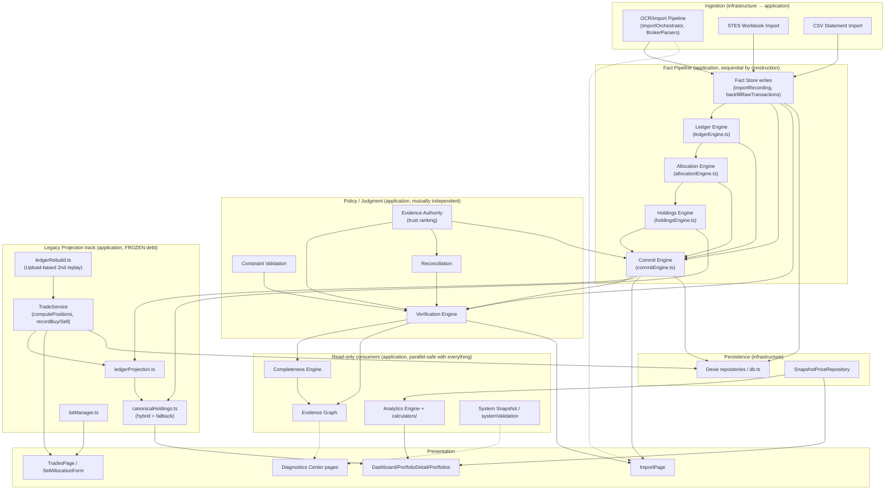

# Execution Graph

A task-planning map of this repository's subsystems, for deciding **what a change touches, what it
depends on, and what can safely proceed in parallel** — read this alongside `docs/ROADMAP.md` (the
backlog) and `docs/ARCHITECTURE.md` (the enforced layering) before starting multi-part work. This
document is a planning artifact for whoever (human or AI agent) works on this repo next; it does not
introduce any orchestration runtime into the app itself — nothing here changes how the product executes,
only how work on the product is scoped.

**This is a formalization, not a discovery of new structure.** Every edge below already exists as either
a TypeScript import, a Dexie table, or a rule in `.dependency-cruiser.cjs` / `src/architecture/regressionGuards.test.ts`.
Where this repo already has a deeper authority on a subsystem (`docs/PORTFOLIO_OS_V2_SPEC.md` Part 5's
Ownership Matrix, `docs/ARCHITECTURAL_DEBT.md`'s violation catalog), this document links to it rather than
re-deriving it — this file's job is the cross-subsystem *shape*, not the per-field detail.

## How to use this

1. Find the node(s) your task touches in the table below.
2. Read every node upstream of it (its "Depends on" column, transitively) — those behaviors are
   assumed, not renegotiated, by your change.
3. Skim every node downstream of it ("Consumers") — those are what you might silently break.
4. Two nodes can be worked on **in parallel** (by two people, or two agents) only if neither is upstream
   of the other *and* their "Shared state" columns don't intersect. See "Parallel-work rules" below —
   this is stricter than "different files," because several nodes share Dexie tables or a canonical
   single-owner function without importing each other directly.
5. If your task would add a new writer to a table already listed as `FROZEN` in
   `docs/ARCHITECTURAL_DEBT.md`, or a new implementation of a function `regressionGuards.test.ts` asserts
   is singular — stop and treat it as a policy decision, not a routine change. The guard will fail CI
   either way; this graph exists so that's known before work starts, not after.

## Layering (recap — full detail in `docs/ARCHITECTURE.md`)

```
presentation  →  application  →  domain
infrastructure  →  domain
```

Machine-enforced by `.dependency-cruiser.cjs` (`npm run arch:check`). Every node below lives inside
exactly one of these four layers; the graph in this document is the **intra-layer and cross-layer
dependency structure inside that boundary**, one level more granular than the four-layer diagram.

## The graph



Solid arrows are hard data/type dependencies (an import or a direct call). Dotted arrows are "reads the
output of" without a compile-time dependency (e.g. a UI page reading a repository the engine also writes
through).

## Subsystem table

| Node | Responsibility | Inputs | Outputs | Depends on | Consumers | Shared state |
|---|---|---|---|---|---|---|
| **Fact Store writes** (`importRecording.ts`, `backfillRawTransactions.ts`, `rawTransactionFolds.ts`) | Append-only creation of `RawTransaction` facts from parsed evidence | `ParsedTradeCandidate`/`ParsedDividendCandidate`, existing facts (for identity dedup via `findLiveExecutionFact`) | New `RawTransaction` rows | `evidenceAuthority.ts` (authority rank on write) | Ledger Engine, Commit Engine, Verification Engine | `rawTransactions` table (append-only, structurally enforced — see `RawTransactionRepository`) |
| **Ledger Engine** (`ledgerEngine.ts`) | Pure replay: `RawTransaction[]` → `LedgerEvent[]` for one (portfolio, ticker) | Facts | `LedgerEvent[]` | `ledgerRebuild.ts` (canonicalization only) | Allocation Engine, Commit Engine, Holdings Engine, System Snapshot | None (pure function; `regressionGuards.test.ts` asserts this file is the only definer of `generateLedgerEvents`) |
| **Allocation Engine** (`allocationEngine.ts`) | Pure replay: `LedgerEvent[]` → `Allocation[]` | LedgerEvents | `Allocation[]` | Ledger Engine (types only) | Commit Engine, Holdings Engine, System Snapshot | None (pure; sole definer of `generateAllocations`) |
| **Holdings Engine** (`holdingsEngine.ts`) | Pure replay: Ledger + Allocations → current positions | LedgerEvents, Allocations | Position map | Ledger Engine, Allocation Engine (types only) | `canonicalHoldings.ts`, `systemValidation.ts`, System Snapshot | None (pure; one of 3 frozen position-computation functions) |
| **Commit Engine** (`commitEngine.ts`) | Orchestrates verify → replay → cache for one (portfolio, ticker); the only writer of `CommittedLedgerRepository` | Facts for the key | `ledgerCache`/`allocationsCache` rows | Verification Engine, `ledgerProjection.ts`, `ledgerRebuild.ts` (canonicalKey), `evidenceAuthority.ts`, `duplicateDetection.ts` | `PortfolioService`, `lotManager.ts`, `reconciliationSweep.ts`, `systemSnapshot.ts`, ImportPage | `ledgerCache`, `allocationsCache` (full delete-and-replace per key — **never** patched incrementally); serialized per `${portfolioId}|${ticker}` via `serialize.ts` |
| **Verification Engine** (`verificationEngine.ts`) | Judges each fact Verified/Rejected/Needs Review; computes per-ticker match status | Facts, positions | `TransactionVerification`, `TickerStatus` | `importVerification.ts`, `reconciliation.ts`, `mismatchResolver.ts`, `netShareTimeline.ts`, `constraintValidation.ts`, `rawTransactionFolds.ts` | Commit Engine, Completeness Engine, Evidence Graph, System Snapshot, ImportPage (legacy path, see debt 3.2) | None — pure, read-only; sole definer of `verifyAll`/`verifyAllDetailed`/`verifyTicker` |
| **Completeness Engine** (`completenessEngine.ts`) | Builds minimal-document recovery plans for gaps | Verification output, evidence coverage | `RecoveryPlan` | Verification Engine, `evidenceCoverage.ts` | Evidence Graph, ImportPage | None — pure |
| **Evidence Graph** (`evidenceGraph.ts`) | Read-only composed view: transactions/documents/ticker-position nodes + corroborate/contradict/missing edges | Verification + Completeness output | `{nodes, edges}` | Verification Engine, Completeness Engine, `evidenceCoverage.ts` | Diagnostics Center UI | None — deliberately unpersisted, rebuilt on every read |
| **Reconciliation** (`reconciliation.ts`, `reconciliationSweep.ts`, `mismatchResolver.ts`) | Compares ledger position to `PositionVerification` ground truth; ticker-wide sweep re-commit | Positions, verifications, facts | Mismatch flags, sweep results | `importVerification.ts`, `evidenceAuthority.ts`, `duplicateDetection.ts`, Commit Engine (sweep only) | Verification Engine, PortfolioDetailPage | `verifications` table (owned-mutable) |
| **Evidence Authority** (`evidenceAuthority.ts`) | Canonical trust/authority ranking (`authorityRank`, `higherAuthority`) | Document/source type | Rank | None | Fact Store writes, Commit Engine, Reconciliation, System Snapshot, `lotManager.ts` | None — the **only** file allowed to define an `AUTHORITY_RANK`-shaped table (CI-guarded) |
| **Constraint Validation** (`constraintValidation.ts`) | Inventory/completeness contradiction checks | Facts | `InventoryContradiction[]`, `TickerConstraintReport` | `importVerification.ts` (types) | Verification Engine, `ledgerRebuild.ts` | None — pure |
| **TradeService** (legacy projection) | Use-case layer for Buy/Sell/delete/move on `Trade`/`TradeAllocation`; `computePositions` | UI actions | `Trade`/`TradeAllocation` rows | `ledgerRebuild.ts` (canonicalKey), `ledgerProjection.ts` (resolveLotRef), `rawTransactionFolds.ts`, `duplicateDetection.ts` | `canonicalHoldings.ts`, TradesPage, SellAllocationForm, `ledgerRebuild.ts`, `systemValidation.ts` | `trades`, `tradeAllocations` (**dual-writer, FROZEN** — see `ARCHITECTURAL_DEBT.md` 1.1), `portfolios.cash` (**N writers, OPEN** — debt 1.2) |
| **ledgerProjection.ts** | Rewrites `trades`/`tradeAllocations` rows from replayed facts (the second, disclosed dual-writer) | Facts | `Trade`/`TradeAllocation` rows | `ledgerRebuild.ts`, `rawTransactionFolds.ts`, `duplicateDetection.ts`, Ledger/Allocation Engine types | `canonicalHoldings.ts`, Commit Engine, `lotManager.ts`, `reconciliationSweep.ts` | `trades`, `tradeAllocations` (same FROZEN pair as above) |
| **canonicalHoldings.ts** | Hybrid read: serves canonical (replay-derived) holdings when they agree with legacy, else falls back per-ticker with a disclosed reason | Both computations | Position map + fallback reasons | TradeService, Holdings Engine | Dashboard, PortfolioDetailPage, PortfoliosPage | None — read-only composition; one of 3 frozen position-computation functions |
| **ledgerRebuild.ts** | Alternate, Upload-based reconstruction with dry-run/apply split; the one deliberately-kept second replay pipeline | `Upload.candidates` | Diff vs. current ledger, auto-applicable metadata fixes | `reconciliation.ts`, `constraintValidation.ts`, `importVerification.ts`, TradeService | RebuildLedgerPanel (DataPage), Determinism E2E test | `trades`/`tradeAllocations` metadata-only writes (companyName/transactionNumber — never shares/allocations) |
| **lotManager.ts** | Ticker-scoped manual sell/allocation UI backend; the identity-collision fix's home | UI actions | Facts + replay for one ticker | `commitEngine.ts`, `ledgerEngine.ts`, `allocationEngine.ts`, `ledgerProjection.ts`, `evidenceAuthority.ts`, `serialize.ts` | TickerDetailPage's Lot Manager | `trades`/`tradeAllocations` (stale-allocation cleanup only, on retraction) |
| **PortfolioService.ts** | Deposits/withdrawals/cash adjustments/dividends/splits/rights-issues/archiving | UI actions | `Portfolio`, `TimelineEvent` rows | `commitEngine.ts` (appendAndMaybeCommit, retract) | PortfolioDetailPage, ImportPage (dividends), Dashboard | `portfolios`, `timelineEvents` (owned-mutable) |
| **pendingExecutions.ts** | Partial-fill executions awaiting invoice confirmation | OCR order evidence | `PendingExecution` rows | None (leaf) | ImportPage | `pendingExecutions` (owned-mutable, explicitly not a Fact) |
| **systemValidation.ts / systemSnapshot.ts** | Determinism/observability: cross-checks TradeService vs. Holdings Engine; exports a 7-category state hash | All engines | Validation report / hash | TradeService, Holdings Engine, Ledger/Allocation Engine, Verification Engine, Evidence Authority, Commit Engine | Determinism E2E test, `regressionGuards`-adjacent tooling | None — read-only |
| **Analytics Engine** (`AnalyticsEngine.ts` + `calculators/*.ts`) | Pure metrics: win rate, profit factor, exposure, health score, sector allocation, etc. | `{trades, allocations, timelineEvents, priceMap, cash}` | `AnalyticsResult` | None (each calculator is a standalone pure function; convergence point is `AnalyticsEngine.ts`'s registry) | AnalyticsPage, DashboardPage | None — pure, zero repository dependency |
| **Backup Service** (`BackupService.ts`) | Full-ledger export/import (JSON snapshot) | All 6 core tables | Snapshot file / full replace | None | DataPage | `portfolios`, `trades`, `tradeAllocations`, `timelineEvents`, `journalEntries`, `verifications` (full replace, bulk path — listed as a disclosed exception in the dual-writer guard) |
| **OCR/Import Pipeline** (`ImportOrchestrator.ts`, `parsers/*`, `imagePreprocess.ts`, `tesseractClient.ts`, `pdfText.ts`) | File → `ParsedTradeCandidate`/`ParsedDividendCandidate`/`ParsedOrderEvidence` | Screenshots, PDFs, CSVs | Parsed candidates | `BrokerParser` interface (each parser is independent — `ThndrParser.ts`, `CsvStatementParser.ts`) | ImportPage, Fact Store writes (via `importRecording.ts`) | None directly — writes go through Fact Store writes |
| **STES Workbook Import** (`StesWorkbookParser.ts`) | Frozen AI-exchange `.xlsx` contract → same candidate shapes | STES v1.1 workbook | Parsed candidates | None (routed by `ImportOrchestrator` before text extraction, not a `BrokerParser`) | Fact Store writes | None |
| **Thndr Orders Workbook** (`ThndrOrdersWorkbookParser.ts`) | Account-wide "Orders" export parsing | Workbook | Order evidence rows | None | Verification Engine (order-confirmation evidence) | None |
| **Dexie Persistence** (`db.ts`, `repositories/*.ts`, `purge.ts`) | Implements every domain repository port; the only code allowed to touch `db.ts` directly (dependency-cruiser-enforced) besides `purge.ts` | Domain entities | Persisted rows | Domain repository interfaces only | Every application-layer node (indirectly, via `AppRepositories`) | All 11 Dexie tables (see `regressionGuards.test.ts`'s categorized allowlist) |
| **SnapshotPriceRepository** (`market-data/`) | Reads `public/price-snapshot.json`/`price-history.json`; the only class allowed to read price data | Static JSON snapshot (produced out-of-band by `scripts/fetch-prices` + `update-prices.yml`) | Current price / history per ticker | None | Analytics Engine, Dashboard, PortfolioDetailPage, `PriceFreshness` component | None (read-only static asset) |
| **Diagnostics recorder** (`infrastructure/diagnostics/*`) | Observe-only instrumentation (session/write/read/decision/rule/perf events) | Instrumented call sites | `DiagnosticEvent`/`DiagnosticCase` rows | None | Diagnostics Center pages only | `diagnosticEvents`, `diagnosticCases` — **structurally forbidden** from ever calling a business write method (CI-guarded, zero-tolerance) |
| **ImportPage** (presentation) | Two-phase Extract/Distribute import UI | OCR pipeline output, `importSession.ts` (localStorage-backed pool) | Committed facts via TradeService/Commit Engine/PortfolioService | OCR Pipeline, TradeService, Commit Engine, Verification Engine, PortfolioService, `duplicateDetection.ts` | — | **Known drift**: re-derives some verification signals instead of calling `verifyAllDetailed` (`ARCHITECTURAL_DEBT.md` 3.2) — treat as its own node when touching verification-adjacent UI logic, don't assume it already matches the engine |
| **Dashboard / PortfolioDetail / Portfolios pages** | Read canonical hybrid holdings + analytics for display | `canonicalHoldings.ts`, Analytics Engine, prices | Rendered UI | canonicalHoldings, Analytics Engine, SnapshotPriceRepository | — | Read-only |
| **TradesPage / SellAllocationForm** | Entity-CRUD and lot-picking UI reading `Trade` directly | TradeService | Rendered UI, sell allocations | TradeService | — | Reads `trades`/`tradeAllocations` directly (documented exception to the "read via canonical hybrid" rule — entity-CRUD/lot-picking needs raw rows) |
| **Diagnostics Center pages** | Session Recorder / Writer & Reader Trace / Case Detection UI | Diagnostics recorder, Evidence Graph, System Snapshot | Rendered UI | Diagnostics recorder, Evidence Graph | — | Read-only; never reads a business repository for a business decision (Part 5.4) |

## Parallel-work rules

Derived directly from the table above — these are the concrete answer to "what can run in parallel":

1. **Independent `BrokerParser` implementations are always parallel-safe.** Each parser owns its own
   file and is discovered by `ImportOrchestrator`'s array; the only shared file is `ImportOrchestrator.ts`
   itself (adding the new instance to the array) and `trackedDateRange.ts` (shared date-range helper —
   extend, don't fork). Two people adding two different brokers only conflict on those two files' diff
   hunks, never on parser logic.
2. **Independent analytics calculators are always parallel-safe.** Same shape as above: one file each,
   one shared registration point (`AnalyticsEngine.ts`). Zero repository/state coupling between
   calculators (they're pure functions over the same input struct).
3. **The Fact Pipeline (Fact Store → Ledger → Allocation → Holdings → Commit) is sequential by
   construction for a *single* (portfolioId, ticker) — this is enforced at runtime by `serialize.ts`'s
   per-key queue, not just convention.** Two tasks touching *different* tickers, or different portfolios,
   are genuinely concurrent already (the app itself relies on this). Two tasks touching the *same*
   pipeline stage for the *same* ticker are never safe to parallelize — treat as one task.
4. **Read-only nodes (Analytics Engine, Evidence Graph, System Snapshot, Completeness Engine,
   Diagnostics Center) are parallel-safe against everything**, including each other and the Fact
   Pipeline, because none of them write. A task confined to one of these can proceed independently of
   almost anything else in flight.
5. **The Legacy Projection track (TradeService, `ledgerProjection.ts`, `canonicalHoldings.ts`,
   `ledgerRebuild.ts`, `lotManager.ts`) is the one cluster where "different files" does NOT imply
   "parallel-safe"** — they share two Dexie tables (`trades`, `tradeAllocations`) already flagged
   `FROZEN` (dual-writer) in `ARCHITECTURAL_DEBT.md`. Two simultaneous tasks that each add a write path
   here are the exact bug class that dashboard exists to catch; route both through `regressionGuards.test.ts`'s
   allowlist check before merging either, don't just run them in parallel and hope CI sorts it out.
6. **Policy/Judgment nodes (Verification Engine, Constraint Validation, Reconciliation, Evidence
   Authority) are mutually independent from each other** (no imports between Reconciliation and
   Constraint Validation, for example) but **all sit upstream of Verification Engine** — a task changing
   one of them requires re-verifying Verification Engine's output, not just its own unit tests.
7. **Presentation pages are parallel-safe with each other** unless two tasks touch the same page file or
   a shared component/lib module (`presentation/lib/*`, `presentation/components/*`). `ImportPage.tsx` is
   the one page with real internal complexity (two-phase session state, `mergeSuggestions`,
   `importSession.ts`) — treat any second concurrent task on it as sequential with the first, not
   parallel, even if they touch different UI sections.
8. **A task cannot be parallelized against `.dependency-cruiser.cjs` or `regressionGuards.test.ts`
   themselves** — every other node's "safe to parallelize" status above is *only* true because those two
   files exist and run in CI. They are the single validation point every parallel branch of work
   converges back through, matching the diagram's own "Cross-cutting enforcement" role rather than being
   a node with peers.

## No architectural blockers found

Per this task's own scope (formalize, don't change business logic): nothing in the current architecture
prevents reasoning about it as a dependency graph, or scoping future work against it. The layering rules
(`.dependency-cruiser.cjs`) and the frozen-count guards (`regressionGuards.test.ts`) already encode most
of the edges and shared-state boundaries in this document as machine-checked assertions — this document
adds the *shape* (which nodes exist, how they cluster, what's safe to run in parallel) on top of
constraints that were already real and already enforced. No code changed to produce it.

## Adoption / keeping this in sync

This is a documentation-only deliverable, so there is no code migration plan — the "migration" is
procedural:

1. **Read this alongside `docs/ROADMAP.md` at the start of any session touching more than one
   subsystem** — use it to decide dependency order and what's safe to split across parallel work, per
   "How to use this" above. (`CLAUDE.md`'s "Working on this repo" section now points here.)
2. **Update the table in the same commit as any change that adds/removes/renames a subsystem file,
   changes a dependency edge, or changes which Dexie table a node writes** — same discipline
   `ARCHITECTURAL_DEBT.md` already asks for its own catalog. A stale graph is worse than no graph, since
   it produces confidently wrong parallel-work decisions.
3. **Not done, not planned**: no CI guard cross-checks this document's "Key files"/edges against the
   real import graph automatically. `regressionGuards.test.ts`'s existing source-scan (`sourceScan.ts`)
   could plausibly grow one (e.g. "every file in `application/services/` appears in exactly one graph
   node"), but that's new tooling, not a documentation task — leave it for a future sprint if drift
   between this file and the codebase becomes a real, observed problem, per this repo's own
   "don't build for hypothetical future requirements" convention.
